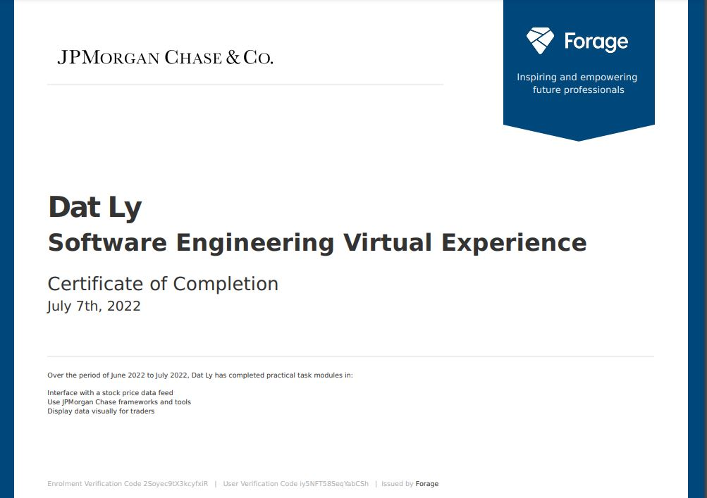

# Forage: JP Morgan Chase Software Engineering Virtual Experience

## Certificate of Completion

## Overview

This Virtual Experience consists of 3 tasks.
+ **Task 1**: Interface with a stock price data feed
+ **Task 2**:  Use JPMorgan Chase frameworks and tools
+ **Task 3**: Display data visually for traders

Projects were edited using several tools, including Python, Javascript, Typescript, React, HTML, git, NodeJS, nvm, and Perspective (JP Morgan's open source data visualization tool)

## Reference
[_Forage Program Link_](https://forage-uploads-prod.s3.amazonaws.com/completion-certificates/J.P.%20Morgan/R5iK7HMxJGBgaSbvk_J.P.%20Morgan_iy5NFT58SeqYabCSh_1657213286555_completion_certificate.pdf)

